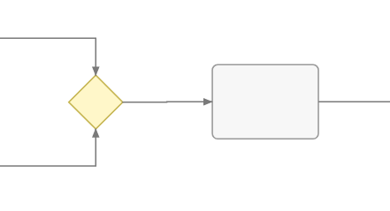
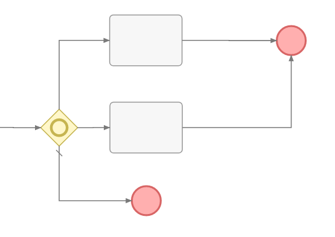
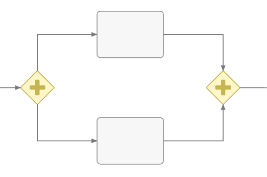
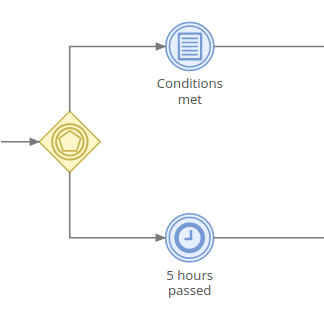

# Business Process Management

Business Process Management (BPM) tool provides an ability to model and automate business processes in EspoCRM. It is available in [Advanced Pack](https://www.espocrm.com/extensions/advanced-pack/) extension.

### Difference with Workflows tool

Workflows tool is intented for automation of simple business rules, w/o sequential flow items, when there is no need to display the flow graphically.

BPM tool is intended for more complex business flows, where can be diverging and converging flows, execution delays, user interactions. A flowchart view makes the business process more comprehensible for a human, a log allows to see how the process was held.

## Process Flowcharts

Available in Administration panel. Also can be added to tab list.

Flowcharts intended for business processes modeling. Administrator can create and edit flowcharts. Regular users can only view flowcharts.

Every flowchart has its specific entity type (Target Type field). The flowchart determines execution of future process instances. It comprises flowchart elements and connections between elements.

If process flowchart has the unchecked 'Is Active' field then it won't initiate process instances.

To show details and parameters of a certain flowchart element you need to click on it. In edit mode you will be able to edit parameters.

## Process

Available in Administration panel. Also can be added to tab list.

Process represents business process instance. When it's initiated it gets status 'Started'. When process is finished it gets status 'Ended'. The process also can be stopped manually by the user who has an access to edit the process. If it's stopped manually it gets status 'Stopped'.

The process is executed according the flowchart. Flowchart of process can't be changed after process is started.

The process obligatorily is related to single target record.

Processes can be started automatically (upon specific conditions or by scheduling) or manually (where there is at least one Start Event in the flowchart). To start process manually the user needs to click 'Start Process' button on the list view of processes.

## Flowchart Elements

### Events

Events are displayed on a flowchart as circles.

#### Start Event

Doesn't have parameters. It's a starting point of the process. Start Event can be initiated manually by user who have an access to create processes. The user needs to click  'Start Process' button on the list view of processes.

#### Conditional Start Event

A starting point of the process. It supposed to be triggered automatically when specified conditions are met. There are two types of trigger: 'After record created', 'After record saved'.

#### Timer Start Event

A starting point of the process. It initiates processes by scheduling. You need to specify the list report that returns records for initiating processes and scheduling in crontab notation.

#### Conditional Intermediate Event

This event stops the flow until specified criteria is met.

#### Timer Intermediate Event

This event stops the flow and waits as long as it's specified by event's parameters. For more complex timer setting you can utilize formula. Formula scripts should return Date-Time value (in UTC timezone). Once this time comes the flow will be proceeded to the next element.

#### End Event

Ends the current flow. It doesn't end flows running in parallel. When the flow reaches to the end event and there is no anything running in parallel then process ends.

#### Terminate End Event

Ends all flows. Process is ended subsequently.

### Gateways

Gateways are displayed as diamonds.

#### Exclusive Gateway

Can diverge or converge flows.

In case of diverging it defines a single flow (path) that will be chosen according specified criteria. The first met condition determines the flow, next conditions are omitted. There is an ability to specify default flow. Default flow is chosen if there are no any met conditions. Default flow is marked with a slash sign.

In case of converging it just directs the flow to the outcoming element. It doesn't get blocked after the flow came though, so parallel flows won't be merged into the single flow.

#### Inclusive Gateway

Can diverge or converge flows.

In case of diverging can direct to one or multiple parallel flows (paths), depending on accomplishment of criteria of each flow. Default flow is chosen if there are no any met conditions. Default flow is marked with a slash sign.

If there is a necessity to merge parallel flows produced by a diverging inclusive gateway you need to use a converging inclusive gateway. It will wait for all incoming flows and then continue to the outgoing element.

Note: Diverging and converging gateways must be balanced.

Note: If one of parallel flows has been ended by some reason then diverging gateway will never be processed. The process will be blocked. Avoid a flowchart design that can bring about such a situation.

#### Parallel Gateway

Can diverge or converge flows.

In case of diverging it splits flow into multiple parallel flows. There is no parameters for this gateway type.

In case of converging it waits until all incoming flow come and then continue to the next outgoing element.

Note: Diverging and converging gateways must be balanced.

Note: If one of parallel flows has been ended by some reason then diverging gateway will never be processed. The process will be blocked. Avoid a flowchart design that can bring about such a situation.

#### Event Based Gateway

Can only diverge flows.

It stops the flow until any of outgoing event gets triggered. Triggered event determines the single flow. Other outgoing events gets rejected.

Only intermediate events can be on the other end of outgoing sequence flows.

### Tasks

#### Task

Tasks are displayed as rounded rectangles.

Task can execute following actions:

* Create Record - creates new record of any entity type;
* Create Related Record - creates new record related to the target record;
* Update Target Record;
* Update Related Record - updates the record or records related to the target record;
* Update Created Record - updates specific field of any record created in the current process;
* Update Process Record - usables to assign the process to specific user or team.
* Link to Another Record - links the target record with a specified record;
* Unlink from Another Record - unlinks the target record from the specified record;
* Apply Assignment Rule - assigns the target record, the process record or any record created by the process according the specific rule;
* Create Notification - creates in-app notificartion for specific users;
* Make Followed - makes specific users to follow the target record, the process record or any record created by the process;
* Run Service Action - runs custom service actions implemented by developers.

#### Send Message Task

Sends email message to specific recipient.

#### User Task

Provides a flexible ability of user interraction. It stops execution until the user (specified explicitly or by assignment rule) resolves the task. Process User Task record will be created in the system. By default there are three action types: Approve, Review, Accomplish.

* Approve type requires the user to chose between 'Aproved' and 'Declined'.
* Review type gives only one option: 'Reviewed'.
* Accomplish type has two options: 'Completed' and 'Failed'.

The user assigned to the created Process User Task record will receive in-app notification. Administrator also can enable email notifications.

Users also can add Process User Tasks dashlet on their dashboard to see their actual process user tasks.

It's possible to read the resolution of the passed user task within diverging gateways or conditional events, making ramification in the process flow.

#### Script Task

Executes the script in Espo-formula language. All set variables (`$variableName`) will be stored and available withing the process.

### Flows

#### Sequence Flow

Represented as a solid arrow. Indicates the order in which process elements will be executed.

## Conditions

Conditional events, exclusive and inclusive diverging gateways have conditions that determine the flow of the process.

Through UI there is an ability to check conditions for following records:

* Target record;
* Records related to the target through many-to-one and children-to-parent relationships;
* Records created by the process via tasks;
* User task records, allowing checking the resolution.

It's also possible to define conditions in espo formula language.

## Examples

### Example 1

### Example 2

### Example 3

