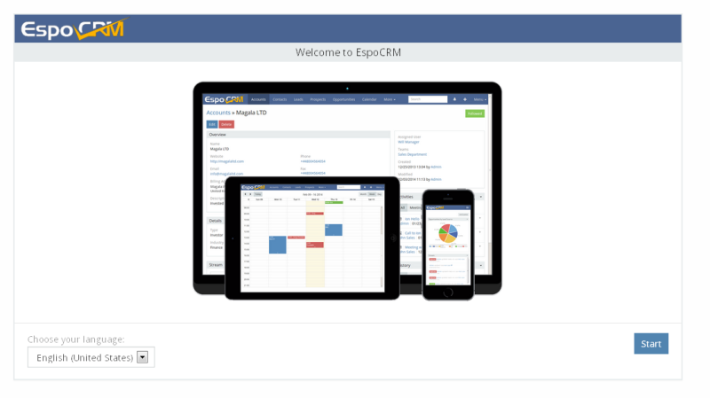
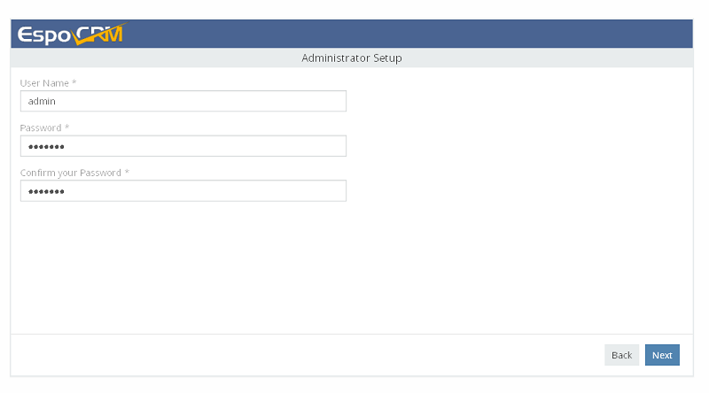
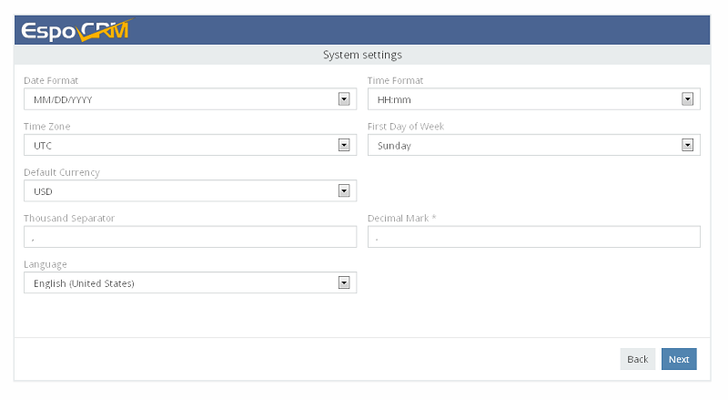

# Installation

### Requirements
EspoCRM runs on the most hosting providers. Requirements include the following:

* PHP 5.5 or latest version of PHP with enabled pdo, json, GD library, mcrypt extensions (usually enabled by default);
* MySQL 5.1 or higher.

See [Server Configuration](server-configuration.md) article for more information.

### 1. Download the EspoCRM installation package
To get the latest version of EspoCRM follow [download page](http://www.espocrm.com/download/) link.

### 2. Upload the EspoCRM Files to Your Server

Once the download is complete, upload the package to your web server. 
To upload it you can use SSH, FTP or the hosting administration panel.
Extract the archive to your public web server directory (e.g., `public_html`, `www`, etc.).

_Note: For FTP, you need to extract the archive before uploading to your web server._

### 3. Create a MySQL Database for EspoCRM to use

Go to your hosting administration panel, or to SSH, and create a new database and user for EspoCRM (e.g., `MySQL Databases` in cPanel).

### 4. Run EspoCRM installation process

Now, open your web browser, and go to the URL with EspoCRM files (e.g., `http://yourdomain.com/espo`).

If you see this screen, you have a "Permission denied" error. 
So, you need to execute the displayed command in the terminal via SSH, or set the correct permission. 
It should be 755 for directories, 644 for files, and 775 for `data` directory. 
Also make sure that you have the correct _owner_ and _group_.

If you see the following screen, the permission is correct and you can start installing EspoCRM.

On this page, you can read and accept the License Agreement.

Enter the details for your newly created MySQL database.

Enter the user name and password of Administrator EspoCRM.

On this page you can set the default settings of EspoCRM, such as date and time format, timezone, currency and others.

Enter SMTP settings for outgoing emails, if you want to have the ability to send emails. 
This step can be skipped by clicking the _Next_ button. 
All of these options can be added/changed in EspoCRM after installation.

Congratulation! Installation is complete. 
The last thing to setup Scheduled Tasks to be run by your system. It can be done by running `crontab -e` in linux cli and in _Windows Tasks Scheduler_ in Windows systems.

We hope you will enjoy working in EspoCRM.

